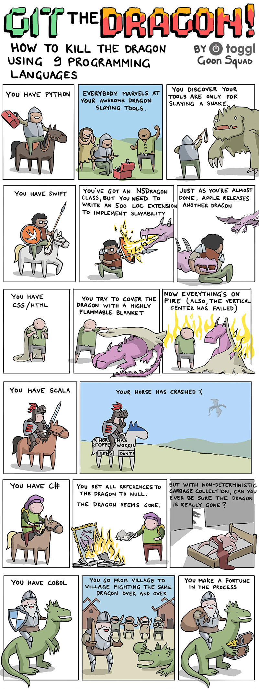

Comics are a very popular form of programming humor. For some, creating a comics is a way to release their frustration. Others got popular or even paid for making comics about IT or an adjacent field. 

In this example, I will show my favourite examples of programming comics. 

## MonkeyUser

A popular webcomic, created by active developers, is [MonkeyUser](https://www.monkeyuser.com/). 

You can follow MonkeyUser on [Twitter](https://twitter.com/ismonkeyuser/), [Instagram](https://www.instagram.com/themonkeyuser/) or [Facebook](https://www.facebook.com/ismonkeyuser). 

## xkcd

xkcd is a very popular webcomic. It's creator, Randall Munroe, worked on robots at NASA's Langley Research Center in Virginia. This was not a typical programming career, but surely involved a lot of programming. That is why many xkcd comics relate to programmers, and often strictly touch programmers problems. Here are a few prominent examples:

You can follow xkcd on [Twitter](https://twitter.com/xkcd/), [Instagram](https://www.instagram.com/xkcd/) or [Facebook](https://www.facebook.com/TheXKCD).

## CommitStrip

Another webcomic created by developers and dedicated to developers is [CommitStrip](https://www.commitstrip.com/). 

You can follow PHCommitStrip on [Twitter](https://twitter.com/CommitStrip/) or [Facebook](https://www.facebook.com/WeAreCoders).

## PHD

[PHD](https://phdcomics.com/) is not strictly about coding, but about PhD students, but it really well relates to our problems as well. 

You can follow PHD on [Twitter](https://twitter.com/phdcomics/), [Instagram](https://www.instagram.com/phd_comics/) or [Facebook](https://www.facebook.com/phdcomics).

## Abstruse Goose

[Abstruse Goose](https://abstrusegoose.com/) is a webcomic with a minimalistic style, often touching topics around programming. 

## Toggl

[Toggl](https://toggl.com/) is a company creating tools for developers and IT companies, but from time to time, they also release great comics. 

## Geek and Poke

[Geek and Poke](https://geek-and-poke.com/) is another popular webcomic dedicated for developers. 

## Other popular comics

There are much more comics for programmers. I cannot name all creators, and not all of them are known, so here are a few honourable mentions. 

